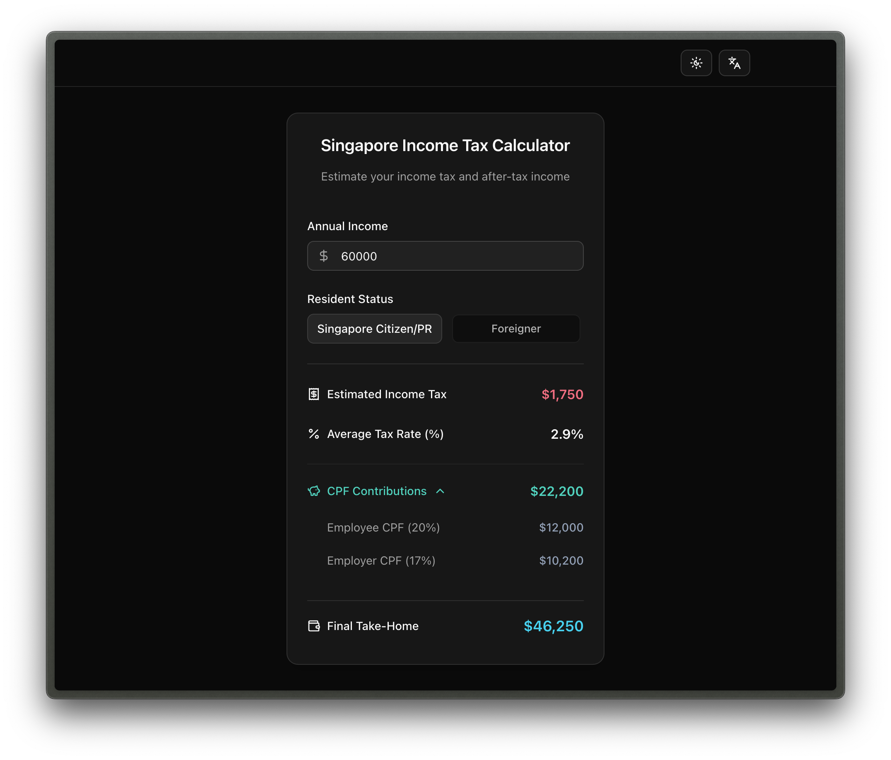

# Singapore Tax Calculator 2025 🇸🇬

✨ **Calculate Now**: [sgtaxcalculator.com](https://sgtaxcalculator.com)

A modern income tax calculator designed specifically for Singapore 2025, featuring multi-language support and responsive design.

## 📱 How to Use

1. Enter your annual income
2. Select your resident status
3. View real-time tax calculation results
4. Expand to see detailed CPF contribution breakdown

## ✨ Features

- 🧮 **Accurate Calculations** - Based on the latest Singapore 2025 tax regulations
- 💰 **CPF Calculations** - Automatic calculation of CPF contributions (Employee + Employer)
- 🌍 **Multi-language Support** - English, Chinese, Malay, Tamil
- 🎨 **Modern UI** - Beautiful interface built with shadcn/ui
- 📱 **Responsive Design** - Perfect adaptation for all devices
- 🌙 **Dark Mode** - Light/Dark theme toggle support
- 🔗 **URL Sync** - Parameters automatically sync to URL for easy sharing

## 🎯 Target Users

- Singapore Citizens / Permanent Residents (includes CPF calculations)
- Foreigners (income tax calculations only)

## 📈 Calculation Features

### Income Tax Calculation

- Based on Singapore's latest 2025 tax brackets
- Automatic average tax rate calculation
- Support for resident and non-resident tax rates

### CPF Calculation (Citizens/PR only)

- Employee contribution: 20%
- Employer contribution: 17%
- Automatic final take-home salary calculation

## 🌐 Multi-language Support

- English
- Chinese (Simplified/Traditional)
- Bahasa Malaysia
- தமிழ் (Tamil)

## 🚀 Tech Stack

- **Frontend Framework**: React 19 + TypeScript
- **Build Tool**: Vite
- **Styling**: Tailwind CSS + shadcn/ui
- **Internationalization**: react-i18next
- **Icons**: Lucide React

---

Built with ❤️ for Singapore residents
